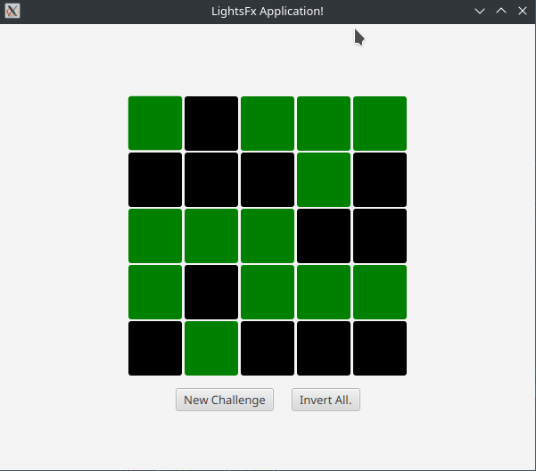

# PT-BR

Esta aplicação foi desenvolvida utilizando JavaFX em conjunto com o Apache Maven para simular o jogo LightsOff, conhecido em distribuições Linux. O jogo consiste em um quadrado 5x5 no qual, ao clicar em um botão, os botões vizinhos (exceto os diagonais) são alternados entre ligados e desligados, assim como o botão clicado. O objetivo do jogo é 'desligar' todas as luzes, alcançando um estado no qual todos os botões estejam desligados.

Diferente do original que possui niveis pré-definidos, esse clone gera randomicamente um novo setup, ademais, possui também a opção de inverter o estado de todos os botões. 

# EN

This application was developed using JavaFX along with Apache Maven to simulate the LightsOff game found in Linux distributions. The game consists of a 5x5 grid where, upon clicking a button, its adjacent buttons (excluding diagonal ones) toggle between on and off, as well as the clicked button itself. The objective is to 'turn off' all the lights, achieving a state where all buttons are turned off.

Unlike the original that has predefined levels, this clone randomly generates a new setup; moreover, it also has the option to invert the state of all buttons.

